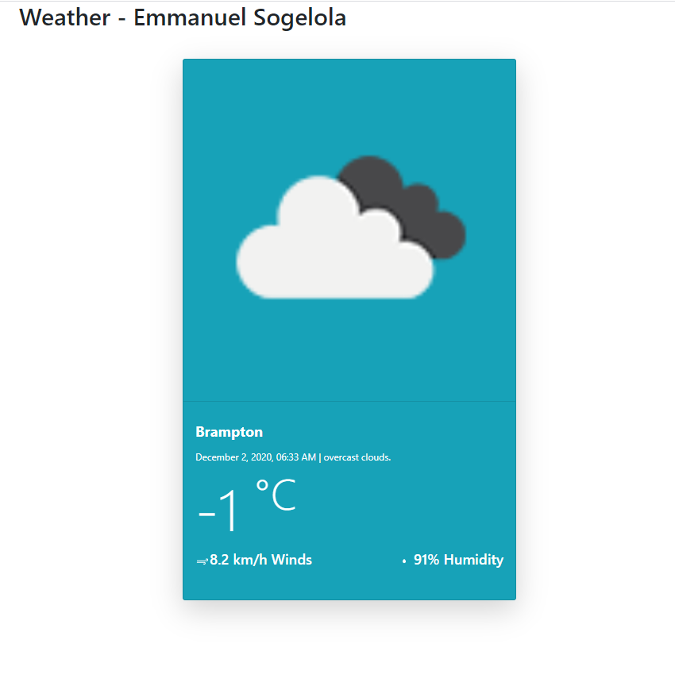

### Weather App
# COMP3123 - Assignment 2

A Web application that will display, a city name, its temperature, the current date, the current weather description and an icon to go along with it.

To run: 
### `npm install`
installs necessary modules

### `npm start`

Runs the app in the development mode.\
Open [http://localhost:3000](http://localhost:3000) to view it in the browser.

